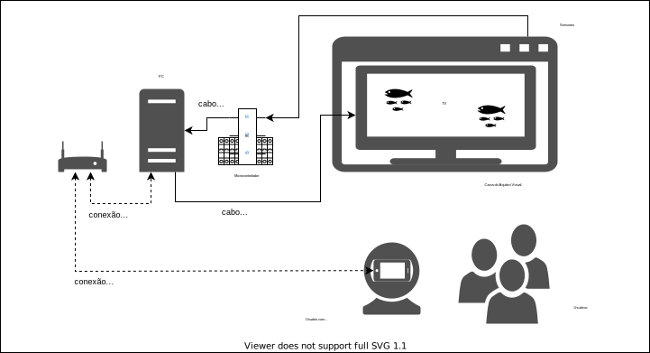

# [GIT Bolsista](https://github.com/anderson-guimaraes/furb-integracao-esp32)

## .. antes ...
No semeste anterior o bolsita se apropriou do conteúdo do projeto. Que envolve entender alguns TCCs já desenvolvidos neste projeto:

### Aquário Virtual
- primeiro TCC FlavioOmar: Aquário Virtual: Simulador de Ecossistema Utilizando Interface de Usuário Tangível
https://furb-my.sharepoint.com/:b:/g/personal/dalton_furb_br/EYhcWZ4sE31LkSPUFAjMvygBeYhFI1f8Q9YJ1TchsHodBA?e=Kb1OqV

- segundo TCC MatheusWaltrichSilva: Aquário Virtual: Multiplayer e Realidade Virtual
https://github.com/dalton-reis/tcc_MatheusWaltrichSilva/blob/master/_TCC2_entregue/textos/tcc_bcc_2020_1_matheuswaltrich_MatheusWaltrichDaSilva-VF.pdf

## reunião 2021-03-09
Conversamos que agora é hora de começar a produzir resultados, já que teve um bom tempo de bolsa para se apropriar do conteúdo.

Entre o que poderia desenvolver vai:
- achar uma forma de conectar os sensores atuais do projeto Aquário direto no PC/NB usando o Unity sem usar a placa IOT
- os sensores são:
  - sensor de luz
  - botão de comida
  - pontenciometro da temperatura

E assim executar o que se tem no Aquário sem uso da placa, usando um PC/NB e uma TV.

--------
## reunião 2021-03-30

#### Hardware

Placa  
sensores (sonar) / potenciômetro  
Cabo micro USB - placa->PC  
PlatBoard  

#### Arduino IDE

Pegou um código de exemplo, teve resultado  

#### Framework C# Arduino

Construir driver  

#### Indicação do prof. Miguel

<https://loja.smartcore.com.br/pagina/blog-faq-familia-nina-u-blox-wifi-ble.html>  
Blogger do prof. Miguel: <https://www.blogger.com/profile/01246279301136130630>

<https://u-blox-nina-b302-remot3.blogspot.com/2021/03/u-blox-nina-w106-sendo-programado-net.html>

Promessa: mostrar uma demo funcionando com a placa + FrameWork C# + driver sonar

--------

## reunião 2021-07-16

